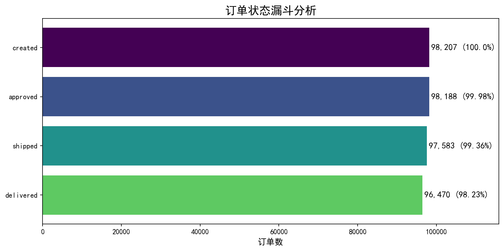
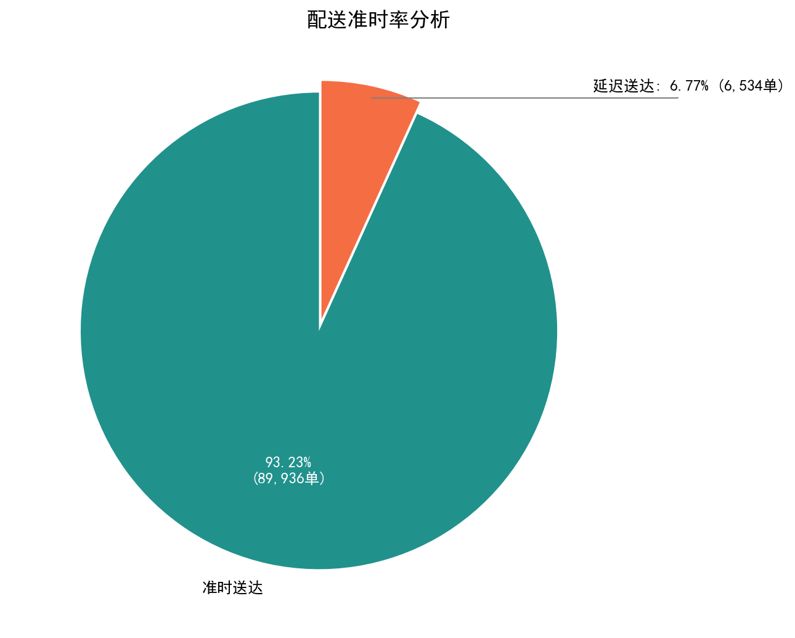
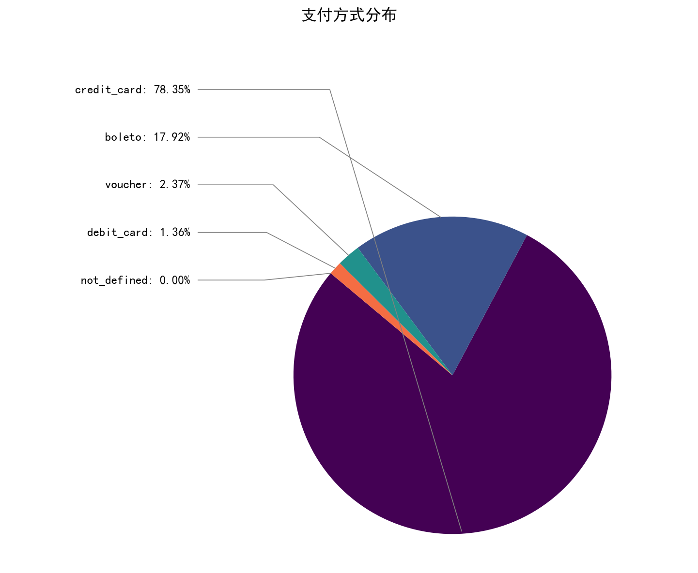
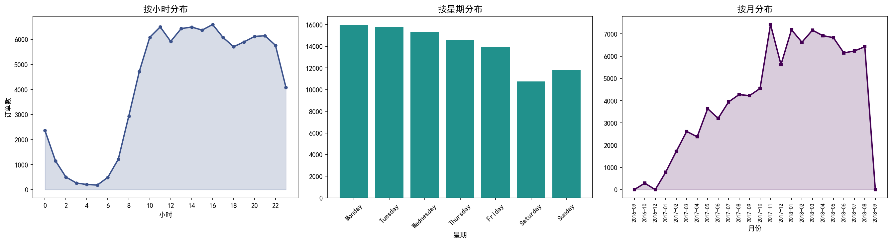
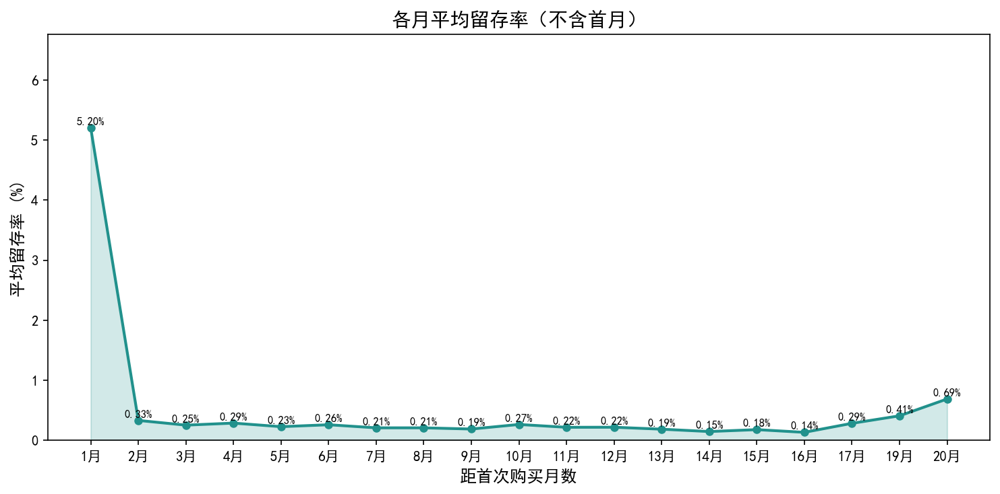
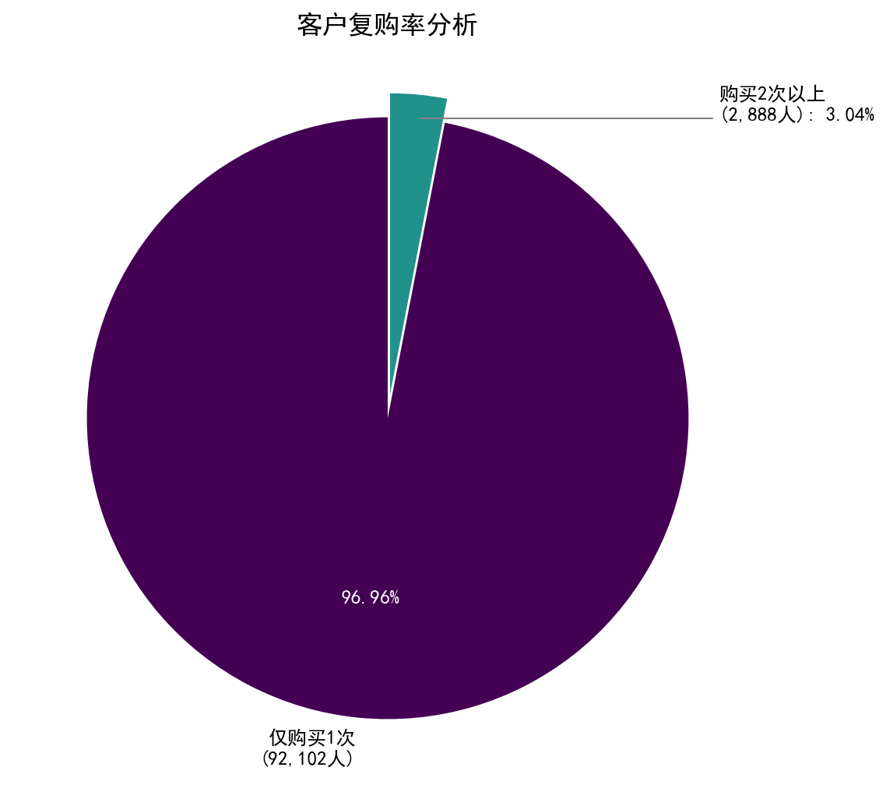
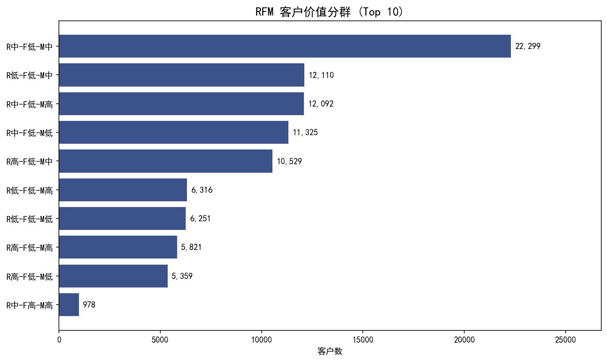
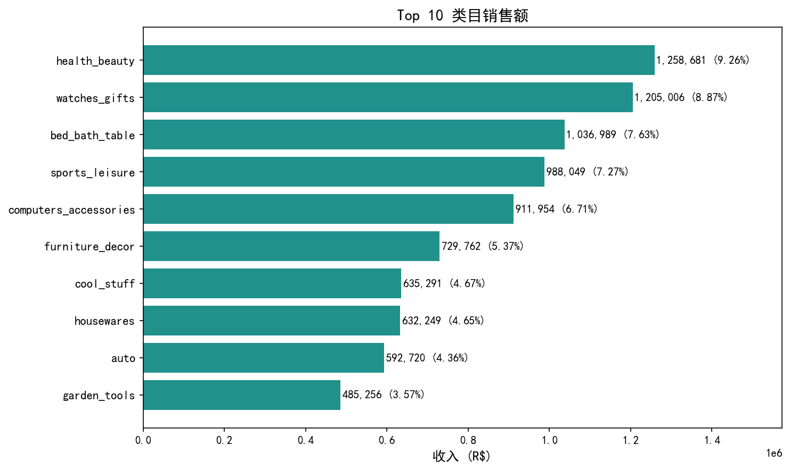
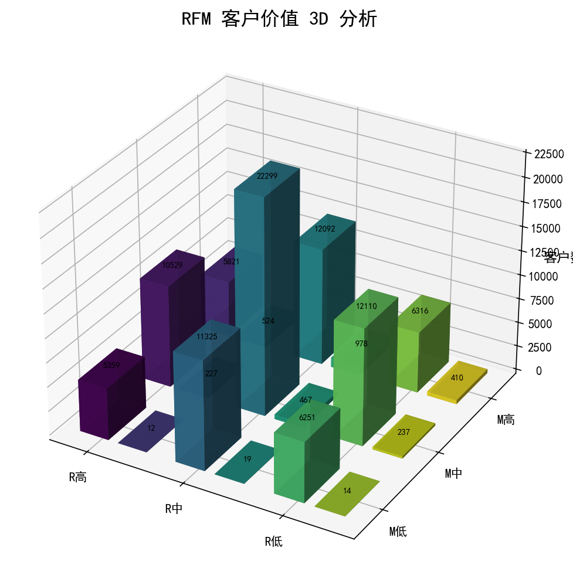

# Brazilian E-Commerce Funnel Analysis

基于 Olist 巴西电商平台数据集的漏斗分析与客户行为分析项目。

## 项目结构

```
ecommerce-funnel-analysis/
├── data/
│   └── raw/                    # 9个CSV原始数据文件
├── src/
│   ├── data_loader.py          # 数据加载与清洗
│   ├── funnel_analysis.py      # 漏斗分析（订单转化、配送绩效、支付方式、购买时间）
│   ├── cohort_analysis.py      # 同期群分析（留存率、复购率、RFM客户价值）
│   ├── category_analysis.py    # 商品类目销售分析
│   ├── visualization.py        # 可视化图表（matplotlib + pyecharts）
│   ├── ecommerce_analysis.ipynb  # Jupyter分析笔记本（含全部图表与结论）
│   └── rfm_3d.html             # RFM 3D交互式图表（pyecharts生成）
├── requirements.txt
└── .gitignore
```

## 数据集

使用 [Brazilian E-Commerce Public Dataset by Olist](https://www.kaggle.com/datasets/olistbr/brazilian-ecommerce)，包含 9 张表：

| 表名 | 行数 | 说明 |
|------|------|------|
| customers | 99,441 | 客户信息（唯一标识 customer_unique_id） |
| orders | 99,441 | 订单状态与时间节点 |
| order_items | 112,650 | 订单商品明细 |
| order_payments | 103,886 | 支付记录 |
| order_reviews | 99,224 | 评价 |
| products | 32,951 | 产品信息 |
| sellers | 3,095 | 卖家信息 |
| geolocation | 1,000,163 | 地理位置 |
| category_translation | 71 | 葡语类目名→英语翻译 |

## 分析模块

### 1. 漏斗分析 (funnel_analysis.py)
- **订单状态漏斗**：创建 → 批准 → 发货 → 送达，整体转化率 98.23%
- **配送绩效**：准时率 93.23%，延迟率 6.77%，平均配送 12.1 天，平均提前 11.9 天送达
- **支付方式分布**：信用卡 78.34%，Boleto 17.92%，代金券 2.37%，借记卡 1.36%
- **购买时间模式**：按小时/星期/月度分析订单分布

### 2. 同期群分析 (cohort_analysis.py)
- **留存率**：按客户首次购买月份分组，追踪月度留存。第1月5.20%，第2月骤降至0.33%，之后趋近于0
- **复购率**：94,990个客户中仅2,888人购买2次以上，复购率3.04%
- **RFM客户价值分层**：R(3档)×F(2档)×M(3档) = 18种组合，最大群体"中-低-中"（22,299人）

### 3. 商品类目分析 (category_analysis.py)
- Top 10 类目销售额与收入占比
- health_beauty 第一（9.26%），watches_gifts 第二（8.87%），bed_bath_table 第三（7.63%）
- 前 5 大类目合计贡献约 39.74% 收入

### 4. 可视化 (visualization.py + ecommerce_analysis.ipynb)
| 图表 | 类型 | 说明 |
|------|------|------|
| 订单漏斗 | 横向柱状图 | 4阶段转化，标签含订单数和转化率 |
| 配送准时率 | 饼图 | 准时93.23% vs 延迟6.77% |
| 支付方式分布 | 饼图 | 5种支付方式，引线标注 |
| 购买时间-小时 | 折线图+面积填充 | 24小时订单分布 |
| 购买时间-星期 | 柱状图 | 周一至周日订单分布 |
| 购买时间-月度 | 折线图+面积填充 | 月度订单趋势 |
| 平均留存率 | 折线图+面积填充 | 各月平均留存率（不含首月） |
| 客户复购率 | 饼图 | 一次性消费 vs 复购客户 |
| RFM分群Top10 | 横向柱状图 | 18种组合中客户数最多的10组 |
| RFM 3D | 交互式3D柱状图 | R×F为X轴，M为Y轴，客户数为Z轴 |
| 类目销售额 | 横向柱状图 | Top 10类目收入与占比 |

## 关键发现

- **转化效率高**：98,207条正常订单中98.23%最终送达，仅1.77%流失
- **配送表现优秀**：93.23%准时送达，平均提前11.9天，平台预估日期较保守
- **支付高度集中**：信用卡+Boleto合计96%，其他支付方式占比极低
- **复购率极低**：仅3.04%客户复购，95%以上一次性消费，平台增长高度依赖拉新
- **客户价值分散**：RFM最大群体"中-低-中"仅占23.5%，缺乏高频高价值客户
- **类目头部效应明显**：Top 5类目贡献近40%收入，长尾类目分散

## 图表展示

### 订单状态漏斗分析


### 配送准时率分析


### 支付方式分布


### 购买时间模式


### 各月平均留存率


### 客户复购率


### RFM客户价值分群 Top 10


### Top 10类目销售额


### RFM 3D 客户价值分析


交互式3D图：[查看](src/rfm_3d.html)（浏览器打开可旋转）

## 快速开始

```bash
# 安装依赖
pip install -r requirements.txt

# 运行完整分析（生成所有图表）
python src/visualization.py

# 或在Jupyter中运行
jupyter notebook src/ecommerce_analysis.ipynb
```

## 技术栈

- Python 3.10+
- pandas, numpy — 数据处理与分析
- matplotlib — 静态可视化（柱状图、饼图、折线图）
- pyecharts — 交互式3D可视化（Bar3D）
- Jupyter Notebook — 探索性分析与结果展示
